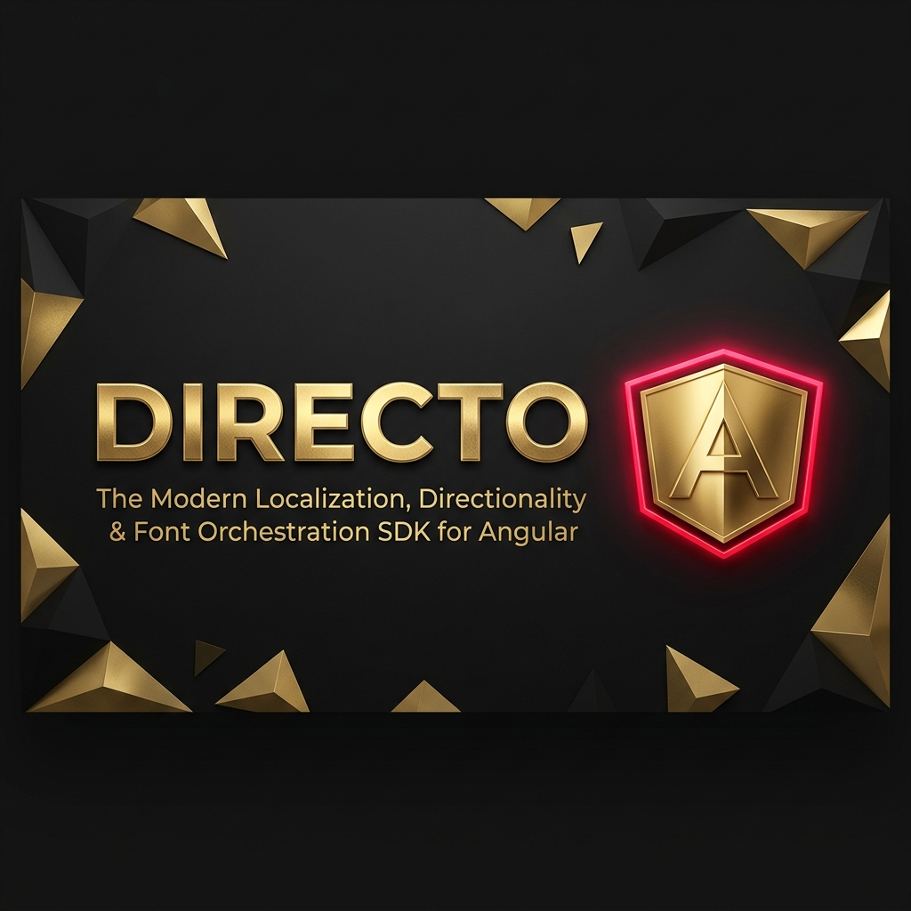

<p align="center">
  
</p>

# ngx-directo

[](https://www.npmjs.com/package/ngx-directo)
[](https://github.com/ahmaed0hakam/ngx-directo/blob/main/LICENSE)
[](https://bundlephobia.com/package/ngx-directo)
[](https://angular.dev/)
[](https://github.com/ahmaed0hakam/ngx-directo)

**The ultimate Angular 18+ Signals-based library for RTL/LTR directionality, Arabic localization, and Google Font orchestration. Zoneless-ready and high-performance.**

---

### ⭐ [Star this on GitHub](https://github.com/ahmaed0hakam/ngx-directo) to support RTL development!

---

ngx-directo is a high-performance, lightweight Angular library for managing bi-directional (RTL/LTR) layouts, dynamic font orchestration, and localized UI state. Built for the modern web, it is fully zoneless-ready and powered by fine-grained Signals.

---

## Key Advantages

- **Zoneless Optimized**: Zero dependence on NgZone. Perfectly compatible with provideZonelessChangeDetection().
- **Reactive Design**: Built entirely on Angular Signals for high-performance state updates.
- **Smart Detection**: MutationObserver-driven script detection for mixed-content isolation.
- **Automatic Font Orchestration**: Dynamic injection of Google Fonts based on active language state.
- **Intelligent Mapping**: Built-in support for all major RTL languages (`ar`, `he`, `fa`, `ur`, etc.) out of the box.
- **CSS-Native Animations**: Direct injection of --dir-sign and --dir-align variables for zero-JS animations.

---

## Installation

```bash
npm install ngx-directo
```

---

## Configuration & Hydration

Initialize the library in your `app.config.ts`. Directo is designed to be **Zero-Config by default**, providing sensible fallbacks for English (LTR) and Arabic (RTL) out of the box.

### Quick Start (Optional)
If you just want to use the directives and pipes without advanced font orchestration or translation management:

```typescript
providers: [
  provideDirecto() // Automatically supports ar, en, he, fa, ur, and more!
]
```

Directo includes an **Intelligent Registry**. If you call `directo.setLanguage('he')`, it automatically knows Hebrew is RTL and swaps your entire layout, even if you didn't configure it.

### Full Configuration & Hydration
For production-grade applications, provide your specific language settings and hydration logic:

```typescript
import { APP_INITIALIZER, inject } from '@angular/core';
import { HttpClient } from '@angular/common/http';
import { firstValueFrom, tap } from 'rxjs';
import { provideDirecto, DirectoService } from 'ngx-directo';

export const appConfig: ApplicationConfig = {
  providers: [
    // 1. Configure the core SDK
    provideDirecto({
      languages: {
        ar: { 
          direction: 'rtl', 
          fontFamily: 'Cairo, sans-serif', 
          googleFontName: 'Cairo', // Auto-injected from Google Fonts
          localizeDigits: true,    // Enables 0-9 to ٠-٩ conversion
          // translations: { WELCOME: 'مرحبا بكم' } // Option A: Inline JSON
        },
        en: { 
          direction: 'ltr', 
          fontFamily: 'Inter, sans-serif',
          googleFontName: 'Inter'
        }
      },
      defaultLang: 'en'
    }),

    // 2. Hydrate translations during bootstrap (Option B: External Files)
    {
      provide: APP_INITIALIZER,
      useFactory: () => {
        const directo = inject(DirectoService);
        const http = inject(HttpClient);
        const lang = directo.currentLang(); 
        
        return () => firstValueFrom(
          http.get(`/assets/i18n/${lang}.json`).pipe(
            tap(data => directo.setTranslations(lang, data))
          )
        );
      },
      multi: true
    }
  ]
};
```

---

## Directives

### [dirAuto] - Intelligent Script Detection
Detects the direction of content (RTL/LTR) automatically using first-strong-character logic.
```html
<p [dirAuto]="dynamicText">{{ dynamicText }}</p>
<p dirAuto>This scans inner text content automatically.</p>
```

### [dirFlip] - RTL Mirroring
Flips icons or elements horizontally only when the app is in RTL mode.
```html
<i dirFlip class="pi pi-chevron-right"></i>
```

### [dirOnly] - Conditional Rendering
Conditionally renders elements based on the active direction.
```html
<div dirOnly="rtl">Only visible in RTL mode</div>
```

### [dirInput] - LTR Input Lock
Forces inputs to remain LTR. Critical for phone numbers, passwords, and codes.
```html
<input dirInput type="tel" placeholder="+966 5XX">
```

---

## Pipes

| Pipe | Description | Example |
| :--- | :--- | :--- |
| **localize** | Multi-strategy localization. Supports direct values, object mapping, or auto-key resolution. | `{{ enVal \| localize : arVal }}` or `{{ item \| localize : 'name' }}` |
| **directoTranslate** | Resolves static UI strings via dot-notation. Can also force a specific language (optional parameter). | `{{ 'KEY' \| directoTranslate : 'ar' }}` |
| **dirMirror** | Swaps directional keywords in strings (left <-> right, next <-> prev). | `{{ 'chevron-right' \| dirMirror }}` |
| **dirNumber** | Transforms Western digits (0-9) to native Arabic-Indic digits (٠-٩). | `{{ 2026 \| dirNumber }}` |
---

## Zero-JS Directional Logic

This is a **Senior-level feature**: Directo enables "Zero-JS" UI logic by injecting reactive CSS variables into the `:root` element. This allows you to handle complex directionality in SCSS without a single line of component TypeScript.

- `--dir-sign`: `1` in LTR, `-1` in RTL.
- `--dir-align`: `left` in LTR, `right` in RTL.
- `--dir-align-inv`: The inverse alignment side.

**SCSS Example:**
```scss
.sidebar {
  transition: transform 0.3s ease;
  // This automatically slides from the correct side in BOTH RTL and LTR!
  transform: translateX(calc(var(--dir-sign) * -100%)); 
}
```

---

## Legacy Support (Optional)
For projects using the classic `@angular/animations` DSL, Directo provides a mirroring utility. Note that `@angular/animations` is an **optional peer dependency** and is only required if you use this specific helper:

```typescript
import { mirrorAnimation } from 'ngx-directo';
// Usage in trigger/transition definitions
```

---

## Authorship and License
Copyright (c) 2026 **Ahmad Alhafi**. All rights reserved.
MIT License
